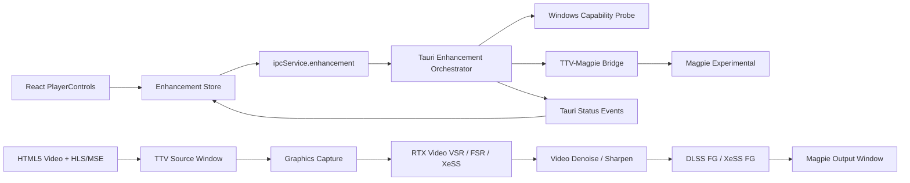

# TDD：Magpie 实时画质增强与视频补帧集成

| 字段 | 内容 |
|---|---|
| 项目 | TTV Short Drama |
| 功能 | 播放页实时画质增强与视频补帧 |
| 方案主体 | SAOG0721/Magpie Experimental + Tauri 原生协调层 |
| 状态 | Draft / 待完成硬件验证 |
| Tech Lead | 待指定 |
| 创建日期 | 待填写 |
| 适用平台 | Windows 10/11，优先 Windows 11 x64 |

## 1. 摘要

本方案为 TTV Short Drama 增加播放页内的“画质增强”和“视频补帧”能力。用户点击播放器控制栏中的增强按钮后，应用负责检测本机能力、启动或连接 Magpie、将当前 Tauri 播放窗口交给 Magpie 捕获，并根据能力启用 RTX Video VSR、降噪、时域超分、锐化和帧生成等效果。

首期采用**外部 Magpie 协调模式**，不把 Magpie 的渲染代码直接链接进 Tauri 进程。Tauri 负责用户体验、能力检测、会话状态、启停、故障降级和日志；Magpie 负责 Windows Graphics Capture、Direct3D 效果链以及 GPU 侧画质增强与帧生成。

交付顺序分两阶段且不可颠倒：**阶段一只做空间画质增强**（VSR / 降噪 / 锐化），可以先用整窗口捕获；**阶段二的视频补帧**必须等到“视频源窗口与控制层分离”完成之后才能开启。依据是本项目在 v0.2.4 已经验证过的事实：整窗口捕获下让 UI 参与光流会直接卡死闪屏（详见 2.1）。

长期目标是把“窗口级增强”演进为“视频源窗口级增强”，避免标题栏、控制器、选集抽屉等 UI 被一起放大并参与时域处理。这既是画质目标，也是补帧能否成立的前提。

## 2. 背景与当前项目约束

当前播放器技术栈：

- 前端：React 19 + TypeScript + Vite。
- 桌面容器：Tauri 2 + Rust。
- 播放器：HTML5 `<video>`。
- HLS：hls.js + WebView2 MSE；动漫资源部分经过 Rust 本地 HLS 代理。
- 播放状态：`usePlaybackStore` 管理播放、暂停、seek、倍速、清晰度、换集和缓存预热。
- 播放器 UI：`VideoSurface` + `PlayerControls`。
- 原生 IPC：`src/services/ipc.ts` 调用 Rust Tauri commands。
- Windows GPU：项目已经显式启用 WebView2 GPU 合成，并打开 HEVC 平台解码支持。

Magpie Experimental 的工作方式不是修改 HTML5 视频流，而是：

```text
捕获目标窗口
  -> Direct3D / Graphics Capture
  -> Magpie effect group
  -> RTX Video / DLSS / FSR / XeSS / FG 等效果
  -> Magpie 输出窗口
```

因此它天然适合“对现有播放器零侵入增强”，但也带来三个约束：

1. 当前 Magpie 主要是**整窗口捕获**，默认会把播放器 UI 一起处理。
2. Magpie 官方公开的编程接口主要是状态通知和窗口属性查询，没有稳定的“启动缩放 / 选择效果组 / 设置参数”公开 API。
3. 帧生成是显示层能力，不会改变 HTML5 `<video>` 的真实时间轴、音频或 `playbackRate`。

### 2.1 历史背景：v0.2.4 已验证并放弃的路线

本项目在 v0.2.4 → v0.2.5 期间已经实验过一轮画质增强与补帧，并在 v0.2.5 全部移除（依据 `CHANGELOG.md` 的 0.2.5 条目与提交 `04d6804`）。已否定的三条路线：

| 路线 | 实现形态 | 结论 |
|---|---|---|
| 全屏钩子捕获 + 补帧 | 捕获画面后送补帧处理 | ❌ **卡死闪屏** —— UI 层被当作视频帧参与光流 |
| mpv 独立窗口 | mpv + VapourSynth + RIFE（114 MB 内核随包分发） | ⚠️ 功能可用，但**交互完全脱节**（播放器 UI 与画面分离） |
| WebView2 内嵌补帧 | WebCodecs + WebGPU | ❌ 需要**重写播放内核**，成本不可接受 |

同时移除的还有：`Lossless.dll` FFI（运行时加载 Lossless Scaling 引擎）、RTX VSR 探测与注册表图形首选项开关，以及前端 `EnhancementFlyout.tsx` / `useEnhancementStore.tsx` / `types/enhancement.ts` 与后端 `enhancement_*` 命令。当时后端留下的结论是“本项目尚未接入真实补帧 SDK”，只保留 `off` 一档；`UserSettings.preferredEngine` / `targetFps` 作为兼容字段保留但恒为 off。

**这对本方案意味着什么（必须正面回答）：**

Magpie 的“整窗口捕获 + 光流补帧”在原理上与上表第一条**属于同一类方案**。如果直接把“整窗口捕获 + FG”作为首个交付，极可能重现同一个闪屏故障。

本方案之所以仍然值得推进，是因为 Magpie 与当年自研钩子有四点本质差异：

1. **空间增强与时域补帧可以解耦。** 只开 RTX Video VSR / 降噪 / 锐化并关闭 FG 时，链路里没有光流，UI 只会被放大和锐化，不会“被当成运动”。当年的闪屏来自补帧，不来自放大。
2. **Magpie 是成熟实现。** Graphics Capture、重复帧检测、逐效果耗时统计、效果组热切换都是现成的；当年是自研钩子，稳定性不在同一量级。
3. **支持 1.0× 同分辨率处理。** 可以只做降噪与去压缩痕迹而不放大，从而避免把 UI 一起放大。
4. **存在根治手段。** 视频源窗口与控制层分离（第 7.3 节）能把 UI 彻底排除出捕获区域；对补帧而言这是**硬前提**而非优化项。

由此得到本方案的硬性约束，与第 3 章目标和第 19 章计划保持一致：

- **空间增强**与**时域补帧**必须分开验证、分开上线，不得作为一次交付捆绑。
- **补帧不得在整窗口捕获模式下开启**；要么完成窗口分离，要么明确不提供补帧。
- 不再重复 mpv 独立窗口、WebView2 重写播放内核这两条已被否定的路线。
- 任何增强故障都不得影响播放本身（保持 v0.2.5 的底线：回归纯 `<video>` + HEVC 系统解码器）。

## 3. 目标与非目标

### 3.1 目标（两阶段交付）

**阶段一：空间画质增强（可独立上线）**

- 播放页提供“画质增强”总开关，点击后无需重新打开视频即可生效。
- 在支持的机器上启用 Magpie 空间效果组：RTX Video VSR + 降噪 + 轻度锐化。
- RTX Video 不可用时降级到 FSR / XeSS / MagpieFX 空间放大 + 锐化。
- 支持 1.0× 同分辨率降噪模式：不放大，只去压缩痕迹，避免放大 UI。
- 自动检测 Magpie、GPU、驱动、效果运行时和当前配置是否可用。
- Magpie 不可用、启动失败或运行异常时，自动回退到普通 `<video>` 播放。
- 播放、暂停、seek、换集、全屏、音量和倍速操作不会破坏播放器状态。
- 记录增强链路的启动耗时、处理耗时、输出帧率、丢帧和错误原因。
- 将功能设计成可扩展的 Engine Adapter，未来可接入 WebGL shader 或其他原生引擎。

**阶段二：视频补帧（依赖窗口分离，见第 7.3 节）**

- 播放页提供“补帧”独立开关；在窗口分离完成前必须置灰并说明原因。
- 窗口分离完成后，通过 DLSS FG / XeSS FG 输出 2×/3× 帧。
- 补帧不改变播放时间轴、音频与 `playbackRate`（见第 6.4 节）。

### 3.2 非目标（两个阶段均不包含）

- 不在 Tauri 进程内直接实现 DLSS、RTX Video 或帧生成算法。
- 不修改 HLS 分片、不重新编码视频、不增加首播等待。
- 不承诺所有 GPU 都能使用 RTX Video VSR 或 DLSS FG。
- 不自动修改 Magpie 的内部 JSON 配置格式。
- 不把 Real-ESRGAN、FlashVSR 等离线或高显存方案作为播放页实时链路。
- 不改变视频音频速度，不把补帧结果写回视频文件。
- 不支持移动端、macOS 或 Linux。

## 4. 方案决策

### 4.1 采用外部 Magpie 协调模式

选择理由：

- 不需要重写当前 HLS、MSE 和 `<video>` 播放链路。
- Magpie 已经拥有 Graphics Capture、D3D 渲染、效果组、性能监测和输入转发能力。
- RTX Video、DLSS、FSR、XeSS 以及帧生成由 Magpie 现成处理。
- 播放器原有暂停、seek、换集、自动连播逻辑可以继续以 HTML5 video 为事实来源。
- 增强失败时可以直接停止 Magpie，原播放器继续播放。

### 4.2 两阶段集成策略

#### 阶段 A：上游兼容模式

使用公开能力：

- 检测 Magpie 进程和缩放窗口。
- 将 TTV 窗口置于前台。
- 发送用户配置好的 Magpie 全局快捷键。
- 监听 `MagpieScalingChanged` 状态广播。
- 读取 Magpie 缩放窗口的源窗口、源矩形和目标矩形属性。

该模式适合快速验证，但存在以下限制：

- 不能稳定地从 TTV 直接选择效果组。
- 热键可能被用户修改、占用或被权限隔离阻断。
- 无法可靠地实时修改 VSR 强度、FG 倍率和光流参数。

#### 阶段 B：TTV-Magpie Bridge

为 SAOG0721/Magpie 增加一个稳定的本地 IPC 接口，TTV 通过 Named Pipe 控制 Magpie。桥接协议只暴露必要的控制能力，不让 TTV 依赖 Magpie 内部 C++ 类布局。

推荐命名管道：

```text
\\.\pipe\ttv-magpie-v1
```

桥接模式提供：

- 查询 Magpie 版本和效果能力。
- 绑定源窗口句柄。
- 启动 / 停止缩放。
- 选择预定义效果组。
- 修改支持 Live 更新的参数。
- 查询缩放窗口句柄和源/目标矩形。
- 订阅缩放状态和性能指标。
- 在源窗口尺寸变化或播放器换集后执行重配置。

**生产版本推荐阶段 B；阶段 A 仅用于尽快验证捕获兼容性。**

## 5. 总体架构



### 5.1 组件职责

| 组件 | 职责 |
|---|---|
| `Enhancement Store` | 保存 UI 状态、功能模式、错误、能力报告和会话指标 |
| `ipcService.enhancement` | 前端到 Rust 的类型化调用封装 |
| `Enhancement Orchestrator` | 整合窗口、Magpie、能力探测、状态机和故障恢复 |
| `Windows Capability Probe` | 探测 OS、GPU、驱动、Magpie 安装和运行时 |
| `TTV-Magpie Bridge` | 将 Tauri 请求转换为 Magpie 内部命令 |
| `Magpie` | 捕获、效果链、补帧和输出窗口 |
| `Playback Store` | 继续负责实际视频播放时间轴和音频 |
| `Metrics Reporter` | 汇总 Magpie 性能和播放器状态，发送到前端 |

## 6. 效果组设计

### 6.1 默认效果组：RTX Video Quality

适用于真人短剧和压缩流媒体：

```text
Input capture
  -> RTX Video VSR
  -> RTX Video Denoise
  -> 轻量锐化 / Lanczos 或平台默认输出
```

建议默认级别：中档。原因是极高档位可能显著增加 GPU 占用，并放大压缩伪影、脸部纹理或字幕边缘问题。

### 6.2 默认效果组：RTX Video + Frame Generation

```text
Input capture
  -> RTX Video VSR
  -> RTX Video Denoise
  -> 轻量锐化
  -> DLSS FG 或 XeSS FG
  -> Output
```

VSR / 降噪应先于补帧。补帧处理已经增强过的帧，可以减少压缩噪点被光流算法误判为运动的概率。

### 6.3 兼容效果组

当 RTX Video 或 DLSS FG 不可用时：

```text
Input capture
  -> FSR / XeSS / MagpieFX spatial scaler
  -> Adaptive Sharpen 或 Anime4K 类 shader
```

该组主要提供清晰度改善，不承诺 AI 级视频重建或补帧。

### 6.4 补帧策略

**硬前提**：补帧只能在“视频源窗口与控制层分离”（第 7.3 节）完成之后开启。在整窗口捕获模式下开启补帧，会让控制器、字幕和按钮参与光流，重现 v0.2.4 的闪屏故障（见 2.1）。在窗口分离完成前，补帧开关必须置灰并给出原因，不得静默生效。

在满足上述前提后，补帧遵循以下规则：

- 默认关闭补帧，只开启画质增强。
- 用户单独打开“补帧”后，优先使用 DLSS FG；不可用时使用 XeSS FG；仍不可用则保持关闭并告知原因。
- 默认目标输出 60 FPS，但实际倍率必须依据源帧率和显示器刷新率决定。
- 不把 `video.playbackRate` 改成 2x 或 3x；补帧只改变显示提交帧，不改变音频和剧情时间。
- `playbackRate !== 1` 时暂时关闭补帧，避免 2x/3x 临时倍速与光流时序冲突。
- seek、切集、缓冲和播放器错误恢复期间暂停或重置补帧，源画面稳定后再恢复。
- 暂停状态下不持续生成运动帧；利用 Magpie 的重复帧检测降低 GPU 占用。

## 7. 播放器窗口策略

窗口策略是本方案成败的核心，而不是实现细节。原因见 2.1：v0.2.4 的闪屏故障正是由“UI 参与光流”引起的。

### 7.1 两种增强对窗口的要求不同

| 增强类型 | 是否产生光流 | 整窗口捕获是否可接受 |
|---|---|---|
| 空间增强（VSR / 降噪 / 锐化 / 放大） | 否 | ✅ 可接受，UI 仅被放大与锐化 |
| 时域补帧（DLSS FG / XeSS FG） | 是 | ❌ 不可接受，UI 会被当作运动产生闪烁与残影 |

这条分界线决定两阶段的交付顺序：**空间增强可以先上，补帧必须等窗口分离完成**。

### 7.2 阶段一：整窗口捕获（仅空间增强）

当前 Tauri 主窗口直接作为 Magpie source window。

适用前提：

- 只启用空间类效果组，FG 保持关闭。
- 不把 UI 放大到失真（建议输出倍率 ≤ 2×，或直接使用 1.0× 同分辨率降噪）。

优点：

- 改动最小。
- 不需要复制 `<video>` 或同步第二个播放器。
- 当前控制器、选集、错误态和全屏状态都能继续工作。

缺点与限制：

- UI 会一起被放大和锐化；字幕、按钮、文字可能出现边缘过锐。
- Magpie 输出窗口与当前 Tauri 全屏机制存在竞争。
- **此模式不支持补帧**：UI 上的 FG 开关必须置灰并说明原因，不得静默开启。

阶段一必须实测确认：WebView2 + Mica + 无边框窗口在 Graphics Capture 下不黑屏、透明正常、DirectComposition 内容不丢失，且键盘 / 鼠标事件经过 Magpie 转发后仍可用。

### 7.3 阶段二：视频源窗口与控制层分离（补帧的前提）

目标结构：

```text
Video Source Window（只渲染视频）
  -> Magpie Capture
  -> Magpie Output Window

TTV Overlay Window（标题、控制条、选集、提示）
  -> 置于 Magpie Output Window 上方
```

只有在这个结构下，捕获区域才只包含视频像素，光流不会碰到 UI，补帧才具备开启条件。

需要解决：

- 两个 WebviewWindow 的生命周期同步。
- 主窗口与 Magpie 输出窗口的 Z-order。
- 透明叠加窗口的鼠标命中与焦点：现有长按 3x 临时倍速、双击全屏、指针 4px 合成事件过滤等交互都依赖真实 PointerEvent。
- 视频窗口尺寸、裁切区域和播放器状态同步。
- 全屏退出、Alt+Tab、任务栏和多显示器行为。

阶段二是补帧的**前置条件，不是可选优化**。若评估后认为窗口分离成本过高，本方案的范围应主动收缩为“只提供空间画质增强，不提供补帧”，而不是带着已知故障上补帧。

## 8. 状态机

```text
unavailable
    -> checking
    -> ready
    -> starting
    -> active
    -> stopping
    -> ready

starting -> degraded     Magpie 启动成功但效果不可用
starting -> error        捕获或运行时失败
active   -> degraded     效果链降级但播放器仍可用
active   -> stopping     用户关闭、换全屏策略或应用退出
error    -> ready        用户重试成功
```

状态字段建议：

```text
EnhancementState {
  availability: unavailable | checking | ready | unsupported | error,
  enabled: boolean,
  mode: off | quality | frame_generation | quality_and_frame_generation,
  engine: auto | rtx_video | dlss | xess | fsr | fallback,
  phase: idle | probing | starting | active | stopping | degraded | error,
  sourceWindowReady: boolean,
  magpieWindowReady: boolean,
  sourceFps: number | null,
  outputFps: number | null,
  droppedFrames: number,
  lastError: string | null
}
```

### 8.1 启动时序

1. 用户点击播放页“增强”。
2. 前端锁定重复点击，状态设为 `checking`。
3. Rust 查询 Magpie 进程、路径、版本、源窗口句柄和基础能力。
4. 检查 TTV 当前窗口是否可捕获；若窗口处于浏览器 Mock 模式，提示仅桌面版支持。
5. 检查当前是否处于 Tauri 原生全屏；若是，先执行统一的窗口策略。
6. 选择效果组和补帧倍率。
7. 将 TTV 窗口置前，启动 Magpie 或连接已有实例。
8. 通过 Bridge 启动缩放；阶段 A 则发送用户配置的热键。
9. 等待 `MagpieScalingChanged` 或 Bridge 的 `scaling_started` 事件。
10. 校验 Magpie source HWND 与 TTV HWND 一致。
11. 等待第一帧输出和稳定帧率。
12. 前端状态切换到 `active`，显示效果徽章和实时指标。

### 8.2 关闭时序

1. 用户点击关闭增强。
2. 状态进入 `stopping`，暂时忽略重复点击。
3. 停止 FG，再停止其他效果组或 Magpie 缩放。
4. 等待源窗口重新获得前台或确认 Magpie 输出窗口销毁。
5. 恢复 Tauri 原生全屏 / 最大化状态。
6. 状态回到 `ready`，HTML5 video 不重新加载、不改变 currentTime。
7. 发生超时则强制终止本次 Magpie session，但不终止播放器。

## 9. Tauri IPC 合约

前端新增 `ipcService.enhancement`，Rust 新增以下 commands：

| Command | 作用 |
|---|---|
| `enhancement_probe` | 查询 Magpie、GPU、驱动和效果可用性 |
| `enhancement_get_status` | 获取当前增强会话状态 |
| `enhancement_start` | 启动指定增强模式 |
| `enhancement_stop` | 停止增强并恢复原始窗口 |
| `enhancement_set_mode` | 切换画质增强、补帧或组合模式 |
| `enhancement_set_parameter` | 修改支持 Live 更新的参数 |
| `enhancement_get_metrics` | 获取当前帧率、耗时和丢帧 |
| `enhancement_select_installation` | 保存用户选择的 Magpie 路径 |
| `enhancement_reset_profile` | 清除 TTV 维护的桥接配置 |

### 9.1 能力报告

```json
{
  "magpieInstalled": true,
  "magpieVersion": "0.6.8-experimental",
  "bridgeVersion": "1",
  "gpu": {
    "vendor": "NVIDIA",
    "name": "..."
  },
  "effects": {
    "rtxVideoVsr": "available",
    "rtxVideoDenoise": "available",
    "dlssFrameGeneration": "available",
    "xessFrameGeneration": "available",
    "fsr": "available"
  },
  "capture": {
    "graphicsCapture": true,
    "webview2Capture": "unknown",
    "requiresAdmin": false
  },
  "limitations": []
}
```

实际实现中应避免根据 GPU 名称硬编码结果；最终能力以 Magpie/运行时初始化结果为准。

### 9.2 启动请求

```json
{
  "sourceWindow": "current-tauri-window",
  "mode": "quality_and_frame_generation",
  "qualityEngine": "auto",
  "frameGenerationEngine": "auto",
  "targetFps": 60,
  "qualityLevel": "medium",
  "captureMethod": "graphics_capture",
  "profile": "ttv-live-video"
}
```

### 9.3 事件

建议使用 Tauri events：

- `enhancement://status`
- `enhancement://metrics`
- `enhancement://capability_changed`
- `enhancement://error`

事件必须携带 `sessionId`，避免旧的 Magpie 会话事件覆盖新会话状态。

## 10. 前端改造点

### 10.1 新增状态层

建议新增 `src/stores/useEnhancementStore.tsx`，不要把 Magpie 状态直接塞进 `usePlaybackStore`。

原因：

- 播放时间轴和显示增强是两个独立状态机。
- 播放器可以在增强不可用时正常工作。
- 未来 WebGL、Magpie、原生视频管线可以复用同一个 UI 状态。

建议新增类型：

- `src/types/enhancement.ts`
- `src/services/enhancement.ts`
- `src/services/magpie.ts` 或仅保留在 Rust bridge 后由 `enhancement.ts` 调用。

### 10.2 PlayerControls

在当前“音量、清晰度、倍速、选集、全屏”区域增加“增强”按钮。

按钮行为：

- 单击：打开增强面板。
- 面板包含：
  - 画质增强开关。
  - 视频补帧开关。
  - 质量档位：自动 / 低 / 中 / 高 / 极高，仅显示能力报告支持的选项。
  - 补帧倍率：自动 / 2x / 3x，仅显示运行时支持的选项。
  - 当前引擎：RTX Video / DLSS FG / XeSS FG / 兼容模式。
  - 状态：正在启动、运行中、已降级、不可用。
  - 输出帧率和处理耗时。
  - 原图 / 增强对比按钮。

按钮不能在无能力时显示成可点击的假开关。应显示“检测显卡能力”或“桌面增强不可用”。

### 10.3 与现有全屏逻辑的关系

当前 `VideoSurface` 使用 Tauri 原生窗口全屏，不使用 DOM 全屏。增强开启后必须引入唯一所有者规则：

- 普通模式：Tauri 控制全屏。
- Magpie 模式：Magpie 控制输出窗口的缩放和目标显示器。
- 增强开启时点击全屏：由增强协调器决定是启动 Magpie 全屏，还是先停止 Magpie 再进入 Tauri 全屏。
- Esc 行为必须统一，避免 Tauri 和 Magpie 同时退出导致状态失步。

阶段一建议策略：增强开启后，播放器全屏按钮执行 Magpie 的输出全屏；用户关闭增强后，再恢复 Tauri 的普通窗口状态。

### 10.4 与播放状态的联动

| 播放事件 | 增强行为 |
|---|---|
| `play` | 若会话已 active，继续处理；否则不自动启动，除非用户开启自动增强 |
| `pause` | 停止新的 FG 帧提交，保留画质增强状态 |
| `seeking` | 暂停 FG，等待 `seeked` 后重新稳定 |
| `loadeddata` | 通知 Magpie 源尺寸可能变化 |
| `waiting` / buffering | 暂停 FG，显示原生缓冲状态 |
| 换集 | 保持增强会话，等待新画面稳定后恢复；失败则降级 |
| `playbackRate !== 1` | 自动关闭 FG，仅保留空间画质增强 |
| 播放器 error | 停止增强，保留原有错误恢复流程 |
| 应用退出 | 先停止增强，再销毁窗口 |

## 11. Rust 原生层设计

### 11.1 模块划分

建议新增：

```text
src-tauri/src/enhancement/mod.rs
src-tauri/src/enhancement/models.rs
src-tauri/src/enhancement/orchestrator.rs
src-tauri/src/enhancement/magpie_bridge.rs
src-tauri/src/enhancement/windows.rs
src-tauri/src/enhancement/metrics.rs
```

Windows 专属代码使用 `#[cfg(windows)]` 隔离，非 Windows 返回明确的 unsupported 状态，不影响编译和 Mock 模式。

### 11.2 窗口能力

需要实现：

- 获取当前 Tauri HWND。
- 设置前台窗口。
- 查询当前窗口是否可见、最小化、全屏或最大化。
- 接收 `MagpieScalingChanged` 注册消息。
- 获取 Magpie scaling HWND。
- 查询 `Magpie.SrcHWND`、源矩形和目标矩形。
- 在必要时调整 Z-order。
- 在 DPI Per-Monitor V2 下处理坐标。

不建议第一版依赖 `SendInput` 作为生产控制方式。它只能作为阶段 A 的临时兼容方案，因为用户改动快捷键、权限级别和焦点都会影响结果。

### 11.3 Bridge 协议

协议应采用请求/响应 + 事件两种消息：

```json
{
  "version": 1,
  "id": "request-uuid",
  "type": "start_scaling",
  "payload": {
    "sourceHwnd": "0x123456",
    "profile": "ttv-live-video",
    "outputMonitor": 0
  }
}
```

响应：

```json
{
  "version": 1,
  "id": "request-uuid",
  "ok": true,
  "payload": {
    "scalingHwnd": "0x987654",
    "state": "active"
  },
  "error": null
}
```

事件：

```json
{
  "version": 1,
  "event": "metrics",
  "sessionId": "session-uuid",
  "payload": {
    "inputFps": 24,
    "outputFps": 60,
    "captureMs": 2.1,
    "effectMs": 7.4,
    "frameGenerationMs": 3.2,
    "droppedFrames": 0
  }
}
```

安全要求：

- Named Pipe 仅允许当前用户 SID 访问。
- Bridge 启动时生成随机 session token。
- 每个请求必须带 token 和协议版本。
- 只接受白名单命令，不接受任意进程启动或任意 DLL 路径。
- 读取 Magpie 可执行文件路径时限制在用户选择目录和应用资源目录。
- Tauri 应用退出后由 Bridge 清理 Magpie 会话。

## 12. 配置与数据迁移

当前设置中已有 `preferredEngine` 和 `targetFps`，但代码将它们视为已废弃并强制保存为 `off`。集成功能时应停止复用旧语义，增加明确的新配置对象：

```json
{
  "videoEnhancement": {
    "defaultMode": "off",
    "engine": "auto",
    "qualityLevel": "medium",
    "frameGeneration": false,
    "frameGenerationMultiplier": "auto",
    "targetFps": 60,
    "autoEnableForAnime": false,
    "autoEnableForShortDrama": false,
    "magpiePath": null,
    "captureMethod": "graphics_capture",
    "showMetrics": false
  }
}
```

迁移原则：

- 旧版本 `preferredEngine = off` 保持关闭。
- 旧版本的 `targetFps` 可迁移到新字段，但必须夹取到 30–120。
- 不因升级自动开启增强。
- 能力不可用时保留用户偏好，但运行状态显示 unsupported，不修改用户设置。

## 13. 性能要求

### 13.1 体验目标

| 指标 | 目标 |
|---|---|
| 点击开关到状态反馈 | 200 ms 内显示 checking/starting |
| 点击开关到增强生效 | 优选 2 秒内；首次初始化允许 5 秒 |
| 关闭增强恢复原播放器 | 1 秒内，不重新加载视频 |
| 播放位置误差 | 启停增强前后不超过 100 ms |
| 增强造成的额外卡顿 | 不得导致播放器主线程持续阻塞 |
| 失败降级 | 1.5 秒内恢复普通播放 |
| 输出目标 | 以显示器刷新率和源帧率为准，不强制 60 FPS |

以上是工程目标，最终数值要按 RTX、AMD、Intel 三类硬件矩阵实测后调整。

### 13.2 帧时间预算

- 24 FPS 源：每个真实帧约 41.7 ms。
- 30 FPS 源：每个真实帧约 33.3 ms。
- 60 FPS 源：每个真实帧约 16.7 ms。

启用补帧后，必须同时观察真实输入帧率和输出帧率。不能只用 Magpie 输出 FPS 判断体验是否成功。

## 14. 失败处理与降级

### 14.1 能力不可用

- Magpie 未安装：显示“未检测到 Magpie”，提供路径选择入口。
- Magpie 版本不兼容：显示版本和需要的最低 Bridge 协议版本。
- GPU 不支持目标效果：隐藏不可用档位，保留兼容锐化模式。
- 运行时 DLL 缺失：显示缺失组件名称，不让播放器进入错误态。

### 14.2 捕获失败

可能原因：

- WebView2 / DirectComposition 捕获异常。
- Mica 或透明窗口导致黑帧。
- DPI 坐标不一致。
- Tauri 窗口没有前台焦点。
- Magpie 输出窗口与 Tauri 全屏冲突。

处理策略：

1. 停止当前增强 session。
2. 恢复 Tauri 原生窗口状态。
3. 保留 `<video>` currentTime、音量和播放状态。
4. 允许用户重试一次。
5. 若再次失败，锁定本次播放的 Magpie 自动启动，避免反复黑屏。

### 14.3 运行中异常

- 输出帧率持续低于真实帧率：先关闭 FG，保留画质增强。
- GPU 处理耗时超过预算：降低质量档位。
- 连续丢帧超过阈值：进入 degraded，并提示“已关闭补帧以保持流畅”。
- Magpie 进程退出：恢复原播放器并记录崩溃信息。

## 15. 测试策略

### 15.1 单元测试

- Enhancement 状态机转移。
- 旧配置迁移和默认值。
- sessionId 去重，防止旧事件覆盖新会话。
- 模式选择和能力矩阵降级。
- 播放速率、seek、换集事件对 FG 的控制。
- Windows HWND 和矩形属性的安全转换。

### 15.2 集成测试

- Tauri 获取当前窗口 HWND。
- Bridge 创建、握手、心跳和断开恢复。
- `start_scaling` / `stop_scaling` 状态闭环。
- Magpie scaling window 与源 HWND 匹配。
- Tauri 与 Magpie 的全屏互斥。
- 切换 HLS 视频、MP4 视频和本地缓存视频。
- 720p、1080p、竖屏短剧、横屏动漫和带字幕视频。

### 15.3 手工硬件矩阵

至少覆盖：

| 类别 | 测试内容 |
|---|---|
| NVIDIA RTX | RTX Video VSR、DLSS FG、组合效果 |
| NVIDIA 非 RTX | 兼容空间增强，能力降级 |
| AMD | FSR / XeSS 兼容路径、补帧不可用提示 |
| Intel | XeSS 兼容路径、驱动缺失处理 |
| 核显 | 关闭 AI 效果，保证普通播放不受影响 |
| 多显示器 | DPI、输出显示器选择、窗口移动 |
| 窗口状态 | 普通、最大化、Tauri 全屏、Magpie 全屏、Alt+Tab |
| 播放状态 | 播放、暂停、seek、换集、自动连播、3x 长按 |

### 15.4 长时间稳定性

- 连续播放至少 2 小时。
- 每 5–10 分钟切换一次增强开关。
- 至少切换 20 集。
- 重复执行 seek、暂停、恢复和窗口缩放。
- 观察内存、显存、句柄、GPU 利用率和帧时间。

## 16. 监控与诊断

日志统一使用结构化字段：

```json
{
  "event": "enhancement_session_ended",
  "sessionId": "...",
  "engine": "rtx_video",
  "frameGeneration": true,
  "sourceResolution": "1280x720",
  "outputResolution": "2560x1440",
  "sourceFps": 24,
  "outputFps": 48,
  "durationSeconds": 1830,
  "droppedFrames": 4,
  "reason": "user_disabled"
}
```

不得记录：

- 视频源中的鉴权参数、解密密钥或完整 URL。
- 用户目录中的敏感路径，除非用户主动导出诊断日志。
- GPU 驱动中可能包含的隐私信息。

建议的性能指标：

- `enhancement.start_latency_ms`
- `enhancement.capture_ms`
- `enhancement.effect_ms`
- `enhancement.frame_generation_ms`
- `enhancement.input_fps`
- `enhancement.output_fps`
- `enhancement.dropped_frames`
- `enhancement.fallback_count`
- `enhancement.session_duration_ms`

## 17. 许可、分发与安全边界

Magpie-derived source code 使用 GPLv3。TTV 集成前必须确定分发策略：

### 方案一：用户自行安装 Magpie

- TTV 不打包 Magpie 和第三方运行时。
- 设置页让用户选择 `Magpie.exe`。
- TTV 只通过公开 IPC / Bridge 与用户安装的程序交互。
- 分发边界最清晰，适合早期验证。

### 方案二：随 TTV 分发 Magpie

- 必须附带 GPLv3 license、版权声明和对应源代码获取方式。
- 如果分发修改版 Magpie，必须提供修改后的对应源代码。
- RTX、DLSS、XeSS 等专有 SDK、运行时和 DLL 不能默认放入仓库或安装包，必须逐项审核其再分发权限。
- 安装器、更新器和卸载器必须明确哪些组件来自第三方。

阶段一推荐方案一。完成许可审核后再决定是否进入方案二。

安全边界：

- Bridge 只绑定本机当前用户。
- 不允许从远程网络控制 Magpie。
- 不接受前端传入任意 DLL、任意 exe 或任意 shell 命令。
- 启动 Magpie 时默认不提权；只有捕获方式明确需要管理员权限时才提示用户。
- 用户选择的外部程序路径必须经过文件存在性和可执行文件类型校验。

## 18. 回滚方案

### 功能级回滚

使用本地 feature flag：

```text
video_enhancement_enabled = false
```

关闭后：

- 不显示增强按钮，或显示不可用状态。
- 不启动 Magpie/Bridge。
- 不修改现有 `<video>` 播放链路。
- 保留设置数据，后续重新打开功能即可恢复。

### 版本级回滚

- 先关闭功能 flag，再发布回滚版本。
- 不删除用户已选择的 Magpie 路径和配置。
- 不修改现有视频缓存文件。
- 不引入需要数据库 down migration 的强制结构变化。

### 运行时回滚

任何增强错误都必须回到：

```text
HTML5 video + hls.js + 原有播放状态
```

不能因为增强失败而重新解析视频源、清理缓存或改变当前播放质量。

## 19. 实施计划

计划顺序反映第 2.1 节的硬性约束：**空间增强先独立上线，窗口分离完成后才接入补帧**。

### Phase 0：捕获与兼容性验证（分两步，不可合并）

**0a —— 空间增强可行性（决定本方案是否继续）**

- 手动安装 SAOG0721/Magpie Experimental。
- 用 Graphics Capture 捕获 TTV 当前窗口，效果组只含空间效果，**不启用 FG**。
- 验证 WebView2、Mica、无边框、HEVC、HLS、字幕与控制器的捕获表现。
- 验证 1.0× 同分辨率降噪是否可用（避免放大 UI）。
- 验证 Magpie 输出窗口是否正确转发点击与键盘。
- 验证 Tauri 全屏与 Magpie 全屏是否冲突。
- 产出：硬件验证报告 + 黑屏/透明/输入问题清单。**未通过则停止后续开发**。

**0b —— 补帧可行性判定（决定阶段二是否值得投入）**

- 在捕获画面中单独验证 FG，观察 UI 区域是否出现闪烁、残影与重影。
- 预期结论：整窗口捕获下 UI 会参与光流并产生伪影（与 v0.2.4 现象一致）。
- 产出：确认“补帧必须依赖窗口分离”这一判断，或给出反例。

### Phase 1：阶段 A 协调器（仅空间增强）

- 增加 Windows HWND 获取与前台窗口管理。
- 增加 Magpie 进程与缩放窗口探测。
- 增加 `MagpieScalingChanged` 状态监听。
- 增加启停超时与失败回退。
- 用用户配置的快捷键完成第一次端到端启停闭环。
- 产出：可手动配置效果组的一键启停 MVP，**不包含 FG**。

### Phase 2：TTV-Magpie Bridge

- 在 Magpie fork 中实现 Named Pipe server。
- 实现协议版本、握手、心跳和 sessionId。
- 暴露启动、停止、效果组选择、参数更新与指标事件。
- 对 Magpie 内部接口做适配，避免 TTV 依赖内部 C++ 类布局。
- 产出：可由 TTV 稳定控制的实验版 Magpie。

### Phase 3：播放器 UI 与状态

- 新增 `useEnhancementStore`（注意：与 v0.2.5 删除的旧同名文件语义不同，需重新设计状态机，见第 8 章）。
- 在 `PlayerControls` 增加增强面板；补帧开关此时置灰并标注“需要窗口分离”。
- 增加能力检测、不可用说明、降级提示与实时指标。
- 接入暂停、seek、换集、倍速和全屏状态。
- 产出：播放页完整交互（空间增强可用）。

### Phase 4：空间效果组调优与首次发布

- 建立 RTX Video、兼容空间增强两套效果组（暂不建“画质+补帧”组）。
- 调整低、中、高质量档位与输出倍率上限。
- 建立真人短剧、动漫、字幕与低码率视频的默认参数。
- 完成 feature flag、日志与回滚验证后发布。
- 产出：**第一个可发布的画质增强版本**。

### Phase 5：视频源窗口与控制层分离（补帧前置）

- 把播放器视频渲染拆成独立 source window，控制层改为独立 overlay window。
- 解决两窗口生命周期同步、Z-order 与鼠标命中和焦点。
- 迁移植播放器的长按 3x、双击全屏、指针位移过滤等交互。
- 完成 Magpie 输出窗口与 overlay 的坐标和 DPI 对齐。
- 产出：捕获区域只含视频像素的窗口结构。

### Phase 6：补帧接入与调优

- 在窗口分离完成后接入 DLSS FG / XeSS FG。
- 确定源帧率检测与输出帧率策略。
- 实现暂停、seek、换集、倍速下的 FG 暂停与恢复（见第 10.4 节）。
- 建立“画质增强 + 补帧”组合效果组。
- 产出：补帧功能与硬件矩阵。

### Phase 7：稳定性、许可与发布

- 完成长时间播放、换集、全屏与多显示器测试。
- 完成崩溃恢复、日志导出和 feature flag。
- 完成 GPLv3、第三方 SDK、运行时 DLL 的分发审查。
- 决定用户自行安装还是随包分发 Magpie。
- 产出：发布检查清单和回滚包。

## 20. 验收标准

**阶段一（空间画质增强）通过标准：**

- 在至少一种支持的 NVIDIA 硬件上，能从播放页开启 RTX Video 空间增强，且画面可见改善。
- 在无 RTX Video 的机器上，能降级到兼容空间增强或明确提示不可用，不出现误导性的“已增强”。
- 开启与关闭增强不重新解析、不重新下载、不重置 `currentTime`。
- 播放、暂停、seek、换集、自动连播与音量控制均正常工作。
- 增强开启时 UI（控件、字幕）**不出现闪烁、残影或抖动** —— 这是针对 v0.2.4 的回归红线。
- Magpie 启动失败时播放器在 1.5 秒级别内自动回退，不出现永久转圈。
- Tauri 全屏与 Magpie 全屏不会同时持有冲突状态。
- 连续播放 2 小时无明显内存泄漏、句柄泄漏或持续黑屏。
- 所有分发组件的许可证、版权与源代码义务已经确认。

**阶段二（补帧）追加标准：**

- 仅在视频源窗口与控制层分离完成后验收；整窗口捕获模式下不得标记为通过。
- 能从播放页开启补帧，并能观察到输入帧率与输出帧率的区别。
- 捕获区域内不含播放器 UI 像素；补帧不会在控制条、字幕与按钮上产生伪影。
- 暂停、seek、换集与倍速切换时补帧正确暂停与恢复。

## 21. 关键风险与取舍

| 风险 | 影响 | 缓解 |
|---|---|---|
| **重蹈 v0.2.4 覆辙：整窗口捕获 + 补帧导致 UI 闪烁** | 高 | 补帧只在窗口分离后开启；Phase 0b 先验证现象；阶段一的 FG 开关置灰 |
| WebView2 窗口无法稳定被 Graphics Capture 捕获 | 高 | Phase 0a 先做真实窗口验证；未通过则停止，不投入后续开发 |
| Magpie 没有稳定的启动与配置 API | 高 | 阶段 A 用热键验证；生产使用 TTV-Magpie Bridge |
| 整窗口捕获把 UI 一起锐化、过度放大 | 中 | 限制输出倍率 ≤ 2×；优先 1.0× 同分辨率降噪；必要时提前进入窗口分离 |
| FG 对重复帧或低帧率流媒体不稳定 | 高 | 只在源帧率稳定时启动；seek/暂停/倍速时停用；与空间增强解耦 |
| 窗口分离成本被低估，阶段二长期无法交付 | 高 | 把窗口分离列为独立阶段（Phase 5）单独评估；成本过高则主动收缩为“仅空间增强” |
| 全屏、焦点与输入转发冲突 | 高 | 明确单一全屏所有者；状态事件驱动恢复 |
| 专有运行时无法随安装包分发 | 高 | 阶段一采用用户自行安装模式；逐项审核后再考虑打包 |
| GPU/驱动差异导致效果不可用 | 中 | 能力探测、效果器白名单与自动降级 |
| Magpie fork 更新破坏 Bridge | 中 | 协议版本、兼容性矩阵、锁定经过验证的 Magpie 版本 |

## 22. 推荐落地结论

推荐按以下顺序推进：

1. **先做 Phase 0a**：确认 WebView2 + Mica + 无边框的 Tauri 窗口在 Graphics Capture 下能被稳定捕获，且**只开空间效果**时观感可接受。这是唯一值得先投入验证成本的事，未通过就停止。
2. 用 Phase 0b 单独观察整窗口捕获下的 FG 伪影，确认“补帧依赖窗口分离”这一判断，避免把资源投在错误前提上。
3. 阶段一先交付**只含空间增强**的开关（RTX Video VSR / 降噪 / 锐化，可选 1.0× 同分辨率降噪），补帧开关置灰并说明原因。这样能在不触碰 v0.2.4 那个坑的前提下，先拿到可感知的画质收益。
4. 为 Magpie fork 增加 TTV-Magpie Bridge，避免依赖内部配置 JSON 与全局热键。
5. 把**视频源窗口与控制层分离**当作独立工程阶段评估：它是补帧的前置条件，不是优化项。若成本过高，明确对外收缩为“不提供补帧”。
6. 补帧接入后坚持“显示层能力”定位：不改变 HTML5 video 的时间轴、倍速与音频。
7. 在完成 GPLv3、第三方 SDK 与运行时 DLL 的分发审查前，不把修改版 Magpie 或专有 DLL 打进正式安装包。
8. 全程保留 v0.2.5 的底线：**任何增强故障都必须能回退到纯 `<video>` + HEVC 系统解码器，且不影响播放本身**。

## 23. 参考资料

- SAOG0721/Magpie：<https://github.com/SAOG0721/Magpie>
- Magpie 上游项目：<https://github.com/Blinue/Magpie>
- Magpie 编程交互说明：<https://github.com/SAOG0721/Magpie/blob/master/docs/Interact%20with%20Magpie%20programally.md>
- Magpie 捕获方式对比：<https://github.com/SAOG0721/Magpie/blob/master/docs/%E6%8D%95%E8%8E%B7%E6%96%B9%E5%BC%8F%E5%AF%B9%E6%AF%94.md>
- MagpieWatcher：<https://github.com/Blinue/MagpieWatcher>
- 本项目历史决策依据：`CHANGELOG.md` 的 0.2.5 条目、提交 `04d6804`（移除补帧与 RTX VSR 链路）
- 本项目历史路线记录：原 `docs/MODIFICATIONS.md`（已随 `72a5bed` 清理，可经 git 历史取回）
- TTV 当前播放器：`src/components/player/VideoSurface.tsx`、`src/components/player/PlayerControls.tsx`
- TTV 当前 IPC：`src/services/ipc.ts`
- TTV 当前 Rust 入口：`src-tauri/src/main.rs`
