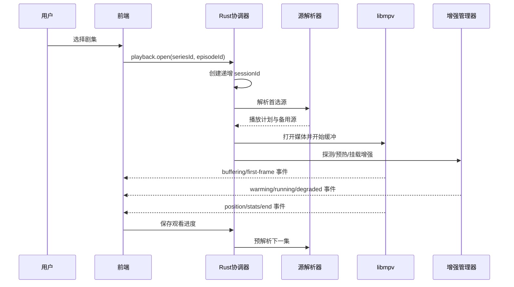

# 短剧播放器前端设计

## 1. 文档目的

本文定义 TTV Short Drama 独立桌面程序的前端页面、功能、交互和状态约定。本文暂不规定颜色、字体、圆角、阴影、动效等视觉样式，视觉设计应在本信息架构稳定后由设计稿和组件规范另行确定。

前端只负责展示状态、收集用户意图和发起类型安全的 Tauri 调用；目录抓取、播放源解析、播放器生命周期、缓存和补帧运行时由 Rust 后端负责。

## 2. 产品范围

程序面向短剧和漫剧的发现、选集、在线播放、断点续播和播放增强。首版范围如下：

| 模块 | 能力 | 首版要求 |
| --- | --- | --- |
| 发现 | 短剧/漫剧频道、分页目录、搜索、分类筛选、排序 | 必须 |
| 详情 | 封面、简介、标签、来源、总集数、完整选集 | 必须 |
| 播放 | 播放、暂停、进度、音量、全屏、清晰度、上一集/下一集 | 必须 |
| 连播 | 播放结束倒计时、取消自动播放、下一集预解析 | 必须 |
| 历史 | 最近观看、断点续播、移除单条、清空 | 必须 |
| 播放增强 | 小黄鸭、RIFE、兼容模式、运行状态和降级提示 | 分阶段 |
| 诊断 | 网络、解析、缓冲、丢帧和增强状态 | 首版提供基础状态 |
| 设置 | 默认清晰度、自动连播、增强偏好、缓存清理 | 必须 |

不在首版范围内的内容包括通用影视库、成人内容、云盘文件管理、社交评论、账号体系和服务端同步。它们不应进入短剧播放器的主导航或播放会话。

## 3. 信息架构与页面

### 3.1 应用壳

应用壳提供全局导航、搜索入口、网络/运行时状态、窗口操作和错误通知。主导航只保留：

1. 发现
2. 观看历史
3. 设置

播放器是独立工作区，可从发现、历史或详情进入，也可以通过返回操作回到来源页面。应用壳不应在播放器工作区叠加详情弹窗或其他媒体模块。

### 3.2 发现页

发现页用于快速找到可播放内容。

页面区域：

- 搜索框：支持提交、清除、最近搜索词；输入过程中不触发高频网络请求。
- 内容频道：短剧、漫剧。切换频道时保留各自的分页游标和筛选条件。
- 分类筛选：题材、受众、时间范围等由后端返回可用筛选项。
- 排序：例如综合、最新；排序变化会重置当前分页但不清除搜索词。
- 继续观看：展示最近记录，主操作是从断点继续。
- 目录列表：分页或滚动加载，卡片至少展示标题、封面、类型、集数、来源和加载状态。
- 空状态/错误状态：区分“没有匹配结果”和“目录请求失败”，提供重试。

交互规则：

- 点击卡片进入详情，不直接启动播放。
- 目录请求需要请求编号；旧请求返回后不得覆盖新筛选结果。
- 滚动加载只允许一个下一页请求在途；连续返回重复数据时停止加载并提示。
- 图片加载失败使用可重试的占位，不影响文本和进入详情。

### 3.3 详情页

详情页承载单个剧集的播放决策。

页面区域：

- 基本信息：标题、类型、标签、简介、来源、总集数和更新时间（若有）。
- 主操作：继续观看；无历史时显示播放第一集。
- 选集：按季分组，显示集数、集标题和已观看进度；支持跳转到当前集。
- 播放源信息：显示当前可用来源和解析状态，不暴露内部令牌或签名 URL。
- 错误反馈：详情失败、选集为空、单集不可解析分别处理。

交互规则：

- 选择一集后进入播放器工作区，并传递稳定的 `seriesId`、`episodeId` 和可选的恢复位置。
- 详情请求和选集请求可缓存；切换剧集时不重复请求完整详情。
- 继续观看必须以历史记录中的集数和位置为准，历史无效时回退到第一集。

### 3.4 播放器工作区

播放器是短剧程序的核心页面，要求在窗口缩放、网络波动、换集和增强失败时保持可用。

页面区域：

- 视频区域：唯一的视频渲染宿主；显示加载、缓冲、恢复、结束和错误状态。
- 播放控制：播放/暂停、上一集、下一集、进度、音量、静音、全屏和返回。
- 清晰度入口：展示后端返回的可选档位和当前档位；换清晰度必须保留播放位置。
- 集数栏：显示当前剧集的完整或分组列表；当前集、已看集、不可用集有明确状态。
- 连播提示：接近结尾时显示下一集标题、剩余秒数和取消按钮。
- 增强状态：展示“关闭、预热中、运行中、已降级、不可用”等真实运行状态，并显示引擎和目标帧率（若有）。
- 诊断入口：可查看缓冲时长、当前播放源、解码帧率、丢帧数和最近恢复原因。

播放控制规则：

- 所有播放操作都带当前 `sessionId`；旧会话的事件必须被前端丢弃。
- 拖动进度条默认执行关键帧跳转；用户明确执行精确定位时才使用精确 seek。
- 网络错误先进入恢复状态并自动尝试备用源；恢复失败后才显示错误页。
- 增强失败只关闭或降级增强，不得暂停或销毁基础音视频会话。
- 换集时保留播放器工作区，先显示新集加载态；首帧到达后再清除加载态。

### 3.5 观看历史页

历史页按最近观看时间展示剧集记录。

每条记录包含封面、标题、类型、当前集数、总集数、进度和最后观看时间。支持：

- 点击继续观看，直接进入对应集数和断点。
- 移除单条记录。
- 清空全部历史，并要求二次确认。
- 历史读取失败时显示本地不可用状态和重试操作。

播放过程中按节流策略保存进度，暂停、退出、换集和播放结束时执行一次强制保存。完成的集数应标记为已看，但仍允许重新播放。

### 3.6 设置页

设置页只呈现短剧播放器相关选项：

- 默认清晰度：自动、最高可用、固定档位。
- 自动连播：开启/关闭，连播倒计时秒数可配置。
- 补帧引擎：自动、关闭、小黄鸭、RIFE、兼容模式。
- 补帧倍率/性能档：由运行时能力返回可用选项。
- 缓存：查看占用、清理目录缓存、清理解析缓存。
- 诊断：导出匿名运行日志，不包含播放令牌和完整 URL。

设置修改后显示“已保存”或明确错误。增强相关设置在能力探测完成前不可选择，不应让用户误以为功能已可用。

## 4. 前端状态模型

前端状态应按领域拆分，避免继续扩张单一运行时脚本。

```ts
type PlaybackUiState =
  | { kind: 'idle' }
  | { kind: 'opening'; sessionId: number; episodeId: string }
  | { kind: 'buffering'; sessionId: number; bufferedSeconds?: number }
  | { kind: 'playing'; sessionId: number; position: number; duration?: number }
  | { kind: 'recovering'; sessionId: number; attempt: number; reason: string }
  | { kind: 'ended'; sessionId: number; nextEpisodeId?: string }
  | { kind: 'error'; sessionId: number; code: string; recoverable: boolean };

type EnhancementUiState =
  | { kind: 'off' }
  | { kind: 'probing' }
  | { kind: 'warming'; engine: string }
  | { kind: 'running'; engine: string; outputFps?: number }
  | { kind: 'degraded'; engine: string; reason: string }
  | { kind: 'faulted'; reason: string };
```

目录、详情、历史和设置也应各自拥有 `idle/loading/ready/error` 状态，并通过请求编号或取消信号防止竞态覆盖。

## 5. 前端与后端契约

前端不拼接解析 URL，不读取本地缓存路径，不直接操作 mpv。建议使用统一的 IPC 客户端：

```ts
catalog.list(input): Promise<CatalogPage>
series.getDetail(input): Promise<SeriesDetail>
playback.open(input): Promise<PlaybackSession>
playback.command(input): Promise<void>
playback.snapshot(input): Promise<PlaybackSnapshot>
history.list(input): Promise<WatchHistory[]>
history.save(input): Promise<void>
enhancement.getCapabilities(): Promise<EnhancementCapabilities>
enhancement.setPreference(input): Promise<void>
```

事件统一包含 `sessionId` 和时间戳。未知事件类型必须被忽略并记录诊断日志，不能导致界面崩溃。

## 6. 播放全链路



任何阶段失败都要有独立结果：解析失败可换源，增强失败可降级，历史写入失败不影响播放，只有基础播放器无法恢复时才结束会话。

## 7. 可用性与验收

- 首屏可以在 Tauri IPC 暂不可用时展示明确的离线/演示状态，不出现空白页面。
- 从选择集数到首帧期间始终有可解释状态，不能无限显示加载动画。
- 换集、换清晰度、恢复播放都不会叠加多个播放器实例。
- 窗口缩放和全屏切换不改变集数栏与控制区域的可操作性。
- 键盘可完成播放/暂停、左右 seek、上下集、全屏和退出。
- 目录、详情、历史和播放错误均可重试，错误文案不泄露内部 URL、令牌或文件路径。
- 基础播放可用率与增强可用率分开统计；增强降级不能被计为播放失败。

## 8. 迁移说明

当前独立项目仍包含从 TTV Box 复制而来的大型 `app-runtime.js`。它可以作为兼容期实现，但新设计应逐步拆为 `catalog`、`series`、`playback`、`history`、`settings` 和 `diagnostics` 前端模块，并通过单一 IPC 客户端访问 Rust。迁移完成前不得继续向旧全局状态追加新的短剧功能。
