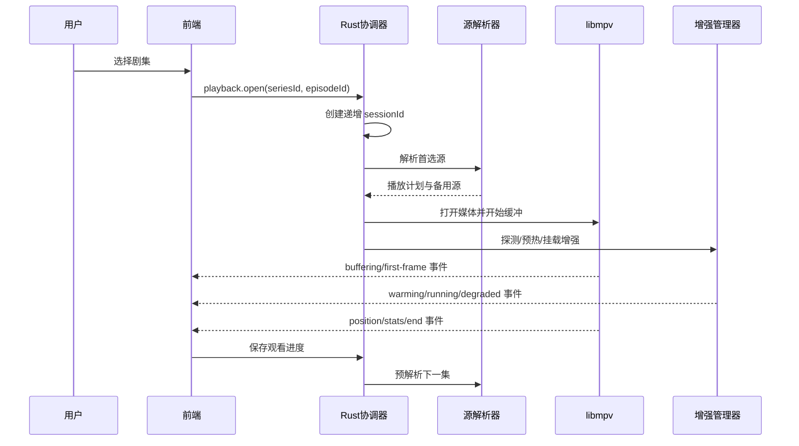

# 短剧播放器前端设计

> ⚠️ **状态：目标架构设计稿（不是现状说明）。**
> 本文描述的是**目标形态**：libmpv 播放内核、补帧引擎（小黄鸭 / RIFE）状态机、`app-runtime.js` 迁移。
> 这些**都没有落地、也不会再落地**——播放内核是 WebView2 里的 `<video>` + MSE(hls.js)，补帧引擎已于 0.2.5
> 整体移除，mpv 与外部播放器兜底已于 0.2.15 删除。本文与下面「现状对照」冲突时，**一律以现状为准**；
> 写代码以 `AGENTS.md` + 代码为准。

## 0. 现状对照（2026-10 校核）

| 本文的说法 | 现状 |
| --- | --- |
| 主导航只有 发现 / 观看历史 / 设置 | 现在是 **发现 / 动漫 / 搜索 / 收藏 / 观看历史 / 设置**（`src/components/layout/NavigationRail.tsx`） |
| 播放内核是 libmpv actor | WebView2 `<video>`。三块播放面：短剧/漫剧 `VideoSurface`（常驻 DOM）、动漫 `AnimeVideoSurface`（按需挂载）、画中画小窗 `MiniPlayer`（独立窗口） |
| 播放增强（小黄鸭 / RIFE / 兼容模式）与 `EnhancementUiState` | 已整体移除（0.2.5）。现在唯一的增强是 `UserSettings.vsr_enabled` → `media_enhance.rs` 把源流转成 **H.264** 本地分片 HLS，让 NVIDIA 驱动触发 RTX VSR（H.264 是硬条件，见 `AGENTS.md` 不变量 25） |
| `enhancement.getCapabilities()` / `enhancement.setPreference()` | 不存在。设置项只有 `default_quality` / `auto_next` / `catalog_cache_mb` / `playback_cache_mb` / `show_adult_sources` / `enabled_sources` / `vsr_enabled` / `launch_sound` / `hardware_acceleration`（`src-tauri/src/models.rs`） |
| `playback.snapshot()` 读运行状态 | 命令还在，但恒返回 `kind: "opening"`、`duration: 0`、`volume: 1` 的占位值，前端**零调用方**；真实播放状态在 store 里由 `<video>` 的 DOM 事件驱动 |
| 事件通道（`playback.state` / `stats` / `enhancement-state`，有界队列） | **不存在事件通道**。前端直接订阅 `<video>` 事件，会话判定靠自增 `sessionId`（不变量 2） |
| 「前端不拼接解析 URL」 | 成立：所有后端交互都过 `src/services/ipc.ts`（另有 `pip.ts` / `windowFx.ts` / `updater.ts` 各自 invoke） |
| §8「从 TTV Box 复制而来的 `app-runtime.js`」 | 仓库里**没有**这个文件，也没有任何 TTV Box 代码；拆分（`stores/` + `services/`）已经完成 |
| 「不在首版范围内：成人内容」 | 已变更：19 个 guo 站源里有 6 个 18+，由「设置 → 内容源分级」显式开关控制（默认关闭，见不变量 19） |
| 键盘：播放/暂停、左右 seek、上下集、全屏 | 成立；另有**长按 ← / → 固定 2 倍速**（`src/services/boostController.ts`，见 `CHANGELOG.md` 0.2.19） |

## 1. 文档目的

本文定义 TTV Short Drama 独立桌面程序的前端页面、功能、交互和状态约定。本文暂不规定颜色、字体、圆角、阴影、动效等视觉样式，视觉设计应在本信息架构稳定后由设计稿和组件规范另行确定。

前端只负责展示状态、收集用户意图和发起类型安全的 Tauri 调用；目录抓取、播放源解析、播放器生命周期、缓存和补帧运行时由 Rust 后端负责。

## 2. 产品范围

程序面向短剧和漫剧的发现、选集、在线播放、断点续播和播放增强。首版范围如下：

| 模块 | 能力 | 首版要求 |
| --- | --- | --- |
| 发现 | 短剧/漫剧频道、分页目录、搜索、分类筛选、排序 | 必须 |
| 详情 | 封面、简介、标签、来源、总集数、完整选集 | 必须 |
| 播放 | 播放、暂停、进度、音量、全屏、清晰度、上一集/下一集 | 必须 |
| 连播 | 播放结束倒计时、取消自动播放、下一集预解析 | 必须 |
| 历史 | 最近观看、断点续播、移除单条、清空 | 必须 |
| ~~播放增强~~ | **已移除**（0.2.5 整体删除补帧；现有 `vsr_enabled` 只是触发驱动侧 RTX VSR） | 不适用 |
| 诊断 | 网络、解析、缓冲、丢帧和增强状态 | 首版提供基础状态 |
| 设置 | 默认清晰度、自动连播、增强偏好、缓存清理 | 必须 |

不在首版范围内的内容包括通用影视库、成人内容、云盘文件管理、社交评论、账号体系和服务端同步。它们不应进入短剧播放器的主导航或播放会话。

## 3. 信息架构与页面

### 3.1 应用壳

应用壳提供全局导航、搜索入口、网络/运行时状态、窗口操作和错误通知。主导航（**现状**；本文原本只列了三项）：

1. 发现
2. 动漫
3. 搜索
4. 收藏
5. 观看历史
6. 设置

播放器是独立工作区，可从发现、历史或详情进入，也可以通过返回操作回到来源页面。应用壳不应在播放器工作区叠加详情弹窗或其他媒体模块。

### 3.2 发现页

发现页用于快速找到可播放内容。

页面区域：

- 搜索框：支持提交、清除、最近搜索词；输入过程中不触发高频网络请求。
- 内容频道：短剧、漫剧。切换频道时保留各自的分页游标和筛选条件。
- 分类筛选：题材、受众、时间范围等由后端返回可用筛选项。
- 排序：例如综合、最新；排序变化会重置当前分页但不清除搜索词。
- 继续观看：展示最近记录，主操作是从断点继续。
- 目录列表：分页或滚动加载，卡片至少展示标题、封面、类型、集数、来源和加载状态。
- 空状态/错误状态：区分“没有匹配结果”和“目录请求失败”，提供重试。

交互规则：

- 点击卡片进入详情，不直接启动播放。
- 目录请求需要请求编号；旧请求返回后不得覆盖新筛选结果。
- 滚动加载只允许一个下一页请求在途；连续返回重复数据时停止加载并提示。
- 图片加载失败使用可重试的占位，不影响文本和进入详情。

### 3.3 详情页

详情页承载单个剧集的播放决策。

页面区域：

- 基本信息：标题、类型、标签、简介、来源、总集数和更新时间（若有）。
- 主操作：继续观看；无历史时显示播放第一集。
- 选集：按季分组，显示集数、集标题和已观看进度；支持跳转到当前集。
- 播放源信息：显示当前可用来源和解析状态，不暴露内部令牌或签名 URL。
- 错误反馈：详情失败、选集为空、单集不可解析分别处理。

交互规则：

- 选择一集后进入播放器工作区，并传递稳定的 `seriesId`、`episodeId` 和可选的恢复位置。
- 详情请求和选集请求可缓存；切换剧集时不重复请求完整详情。
- 继续观看必须以历史记录中的集数和位置为准，历史无效时回退到第一集。

### 3.4 播放器工作区

播放器是短剧程序的核心页面，要求在窗口缩放、网络波动、换集和增强失败时保持可用。

页面区域：

- 视频区域：唯一的视频渲染宿主；显示加载、缓冲、恢复、结束和错误状态。
- 播放控制：播放/暂停、上一集、下一集、进度、音量、静音、全屏和返回。
- 清晰度入口：展示后端返回的可选档位和当前档位；换清晰度必须保留播放位置。
- 集数栏：显示当前剧集的完整或分组列表；当前集、已看集、不可用集有明确状态。
- 连播提示：接近结尾时显示下一集标题、剩余秒数和取消按钮。
- ~~增强状态~~：**已移除**（0.2.5）。现状只有「设置 → 播放增强（RTX VSR）」一个开关，且不把不存在的档位显示成可用（不变量 8）。
- 诊断入口：可查看缓冲时长、当前播放源、解码帧率、丢帧数和最近恢复原因。

播放控制规则：

- 所有播放操作都带当前 `sessionId`；旧会话的事件必须被前端丢弃。
- 拖动进度条默认执行关键帧跳转；用户明确执行精确定位时才使用精确 seek。
- 网络错误先进入恢复状态并自动尝试备用源；恢复失败后才显示错误页。
- 增强失败只关闭或降级增强，不得暂停或销毁基础音视频会话。
- 换集时保留播放器工作区，先显示新集加载态；首帧到达后再清除加载态。

### 3.5 观看历史页

历史页按最近观看时间展示剧集记录。

每条记录包含封面、标题、类型、当前集数、总集数、进度和最后观看时间。支持：

- 点击继续观看，直接进入对应集数和断点。
- 移除单条记录。
- 清空全部历史，并要求二次确认。
- 历史读取失败时显示本地不可用状态和重试操作。

播放过程中按节流策略保存进度，暂停、退出、换集和播放结束时执行一次强制保存。完成的集数应标记为已看，但仍允许重新播放。

### 3.6 设置页

设置页（**现状**；本文原本列的是目标形态）：

| 设置项 | 现状 |
| --- | --- |
| 默认清晰度 | `default_quality`；后端 `settings_save` 会把它**强制为 `auto`**（不变量 8） |
| 自动连播 | `auto_next`，另有连播倒计时 |
| 补帧引擎 / 补帧倍率 | **不存在**（0.2.5 移除；`preferred_engine` 字段保留但恒为 `off`） |
| 播放增强 | `vsr_enabled`：把源流转成 H.264 本地 HLS，触发驱动侧 RTX VSR |
| 内容源分级 | `show_adult_sources`（默认关）+ `enabled_sources`（勾选启用的站源 id） |
| 缓存 | `catalog_cache_mb` / `playback_cache_mb` + 真实占用与清理 |
| 启动音 | `launch_sound`（默认开，见不变量 26） |
| 版本与更新 | 走 Rust 侧 `update_*`（见不变量 13 的补充三/五） |

设置修改后显示「已保存」或明确错误。**不要把不存在的档位显示成可用**（不变量 8）。

## 4. 前端状态模型

前端状态应按领域拆分，避免继续扩张单一运行时脚本。

```ts
type PlaybackUiState =
  | { kind: 'idle' }
  | { kind: 'opening'; sessionId: number; episodeId: string }
  | { kind: 'buffering'; sessionId: number; bufferedSeconds?: number }
  | { kind: 'playing'; sessionId: number; position: number; duration?: number }
  | { kind: 'recovering'; sessionId: number; attempt: number; reason: string }
  | { kind: 'ended'; sessionId: number; nextEpisodeId?: string }
  | { kind: 'error'; sessionId: number; code: string; recoverable: boolean };

type EnhancementUiState =
  | { kind: 'off' }
  | { kind: 'probing' }
  | { kind: 'warming'; engine: string }
  | { kind: 'running'; engine: string; outputFps?: number }
  | { kind: 'degraded'; engine: string; reason: string }
  | { kind: 'faulted'; reason: string };
```

> `EnhancementUiState` 与整套增强状态**已随 0.2.5 的补帧移除一起作废**（见 §0）；`PlaybackUiState` 也从未作为
> 类型实现过——真实状态是 `usePlaybackStore` 里的字段 + `<video>` 事件。

目录、详情、历史和设置也应各自拥有 `idle/loading/ready/error` 状态，并通过请求编号或取消信号防止竞态覆盖。

## 5. 前端与后端契约

前端不拼接解析 URL，不读取本地缓存路径，不直接操作 mpv。现状就是统一的 IPC 客户端（`src/services/ipc.ts`），命令面如下：

```ts
// 目录 / 搜索
catalog.list(filter)            // catalog_list
catalog.fastSearch(filter, kw)  // catalog_fast_search（门闩守卫必须早于缓存查表）
catalog.suggest(kw, channel)    // catalog_suggest
catalog.categories(filter)      // catalog_categories
// 详情 / 封面 / 档位
series.getDetail(seriesId)      // series_detail
series.guoCover(seriesId)       // guo_cover（直达类：18+ 源被关时返回 Err）
series.animeQualities(id)       // anime_qualities
// 播放
playback.open(input)            // playback_open（sessionId 从 100 起自增）
playback.command(cmd)           // playback_command
playback.resolveNative(...)     // short_drama_app_resolve / short_drama_app_resolve_prefix / _stream / _prefetch_stream
// 本地数据
history.list() / history.save() / history.remove() / history.clear()
favorites.list() / favorites.save() / favorites.remove()
settings.get() / settings.save()
cache.clear() / cache.usage()   // cache_clear / short_drama_app_cache_usage
// 窗口 / 小窗 / 更新 / 诊断
window.prepareFullscreen() / window.finishFullscreen()
pip.open(handoff) / pip.handoff() / pip.report() / pip.close() / pip.dismiss() / pip.isOpen()
update.check() / update.download() / update.install() / update.reveal() / app.version()
trace.tail(cursor) / trace.uiLog(line) / trace.clear()
```

事件统一包含 `sessionId` 和时间戳。未知事件类型必须被忽略并记录诊断日志，不能导致界面崩溃。

## 6. 播放全链路

> 下面的时序图是**目标形态**（libmpv + 独立增强管理器）。现状：解析在 Rust（红果 worker / guo FFI / 动漫桥），
> 播放由前端的 `<video>` / hls.js 承担，**没有增强管理器**，也没有事件通道。


```mermaid
sequenceDiagram
    participant U as 用户
    participant UI as 前端
    participant R as Rust协调器
    participant S as 源解析器
    participant P as libmpv
    participant E as 增强管理器

    U->>UI: 选择剧集
    UI->>R: playback.open(seriesId, episodeId)
    R->>R: 创建递增 sessionId
    R->>S: 解析首选源
    S-->>R: 播放计划与备用源
    R->>P: 打开媒体并开始缓冲
    R->>E: 探测/预热/挂载增强
    P-->>UI: buffering/first-frame 事件
    E-->>UI: warming/running/degraded 事件
    P-->>UI: position/stats/end 事件
    UI->>R: 保存观看进度
    R->>S: 预解析下一集
```

任何阶段失败都要有独立结果：解析失败可换源，增强失败可降级，历史写入失败不影响播放，只有基础播放器无法恢复时才结束会话。

## 7. 可用性与验收

- 首屏可以在 Tauri IPC 暂不可用时展示明确的离线/演示状态，不出现空白页面。
- 从选择集数到首帧期间始终有可解释状态，不能无限显示加载动画。
- 换集、换清晰度、恢复播放都不会叠加多个播放器实例。
- 窗口缩放和全屏切换不改变集数栏与控制区域的可操作性。
- 键盘可完成播放/暂停、左右 seek、上下集、全屏和退出。
- 目录、详情、历史和播放错误均可重试，错误文案不泄露内部 URL、令牌或文件路径。
- 基础播放可用率与增强可用率分开统计；增强降级不能被计为播放失败。

## 8. 迁移说明

原文说「项目仍包含从 TTV Box 复制而来的大型 `app-runtime.js`，应逐步拆分」——**这个文件在仓库里从来不存在**，拆分也早已完成：
`src/stores/`（app / catalog / playback / animePlayer / history / favorites / settings 七个独立 store）+ `src/services/`
（`ipc.ts` 是唯一后端入口，另有 pip / windowFx / updater / hlsAttach / animePlayback 等专职模块）。
新增功能按 §3 的约定进对应 store，**不要**再引入跨领域的全局状态。
